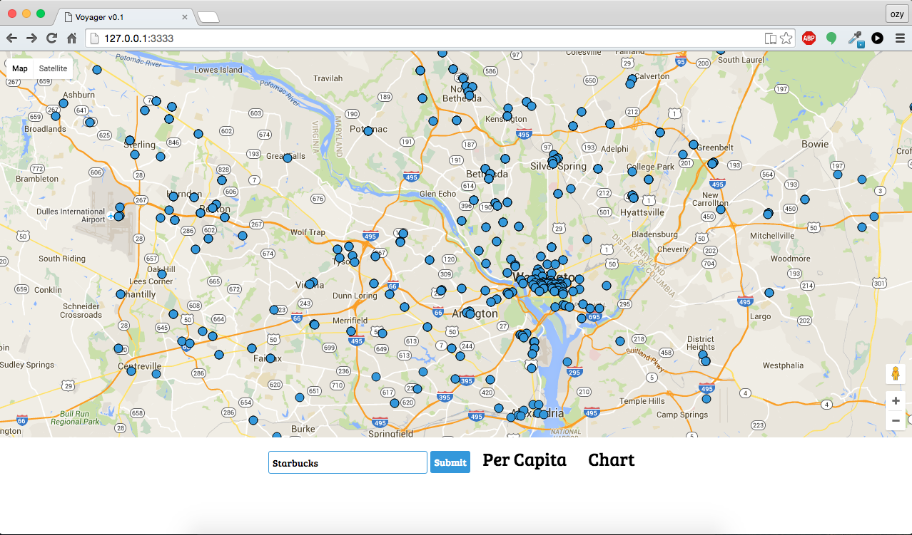

#Voyager 
Voyager is a real-time crowdsourcing web application with an implemented geo map for querying stores, people, items, etc. 

#Version
Beta v0.1

#Full Release Date
Currently this project is in beta, so the estimated release date is in March.